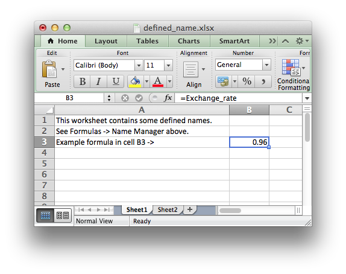

.. _ex_defined_name:

Example: Adding Defined Names
=============================

Example of how to addiing defined names to a workbook.

This method is used to define a user friendly name to represent a value,
a single cell or a range of cells in a workbook. These can then be used
in formulas or anywhere a range is used.

.. literalinclude:: ../../../examples/defined_name.lua
   :language: lua
